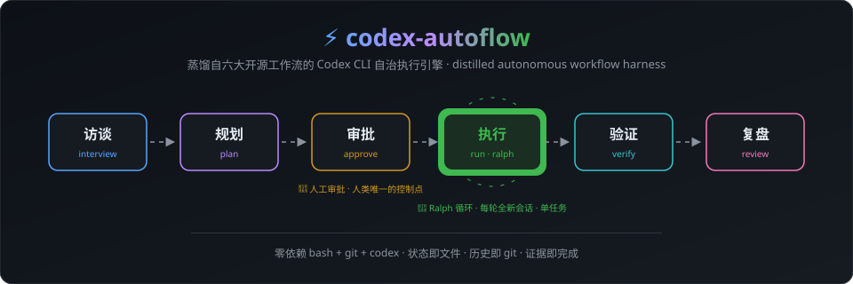
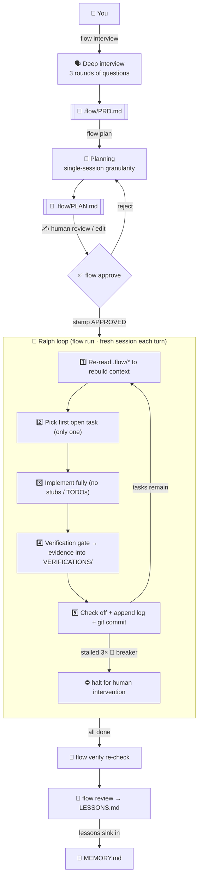

<div align="center">



<br/>

# ⚡ codex-autoflow

### Interview → Plan → Approve → Execute → Verify → Retrospective

### Distilled from 12 open-source projects · Zero dependencies · One bash file

<br/>

[](https://git.io/typing-svg)

<br/>


<br/>

**[中文文档](README.md)** · **[Design notes](docs/DESIGN.md)** · **[Quick start ↓](#-quick-start)**

</div>

<br/>

<table>
<tr>
<td width="50%">

## 💀 The four failure modes of bare Codex

| Failure | Symptom | Fix here |
|:---:|:---|:---|
| 🐠 **Goldfish memory** | Fresh session forgets all progress | `.flow/` state contract + per-turn context re-injection |
| 🚶 **No plan** | Codes first, rewrites later | Interview → plan → **human approval** gate |
| 🎭 **Fake done** | "Done!" with zero tests run | Verification gate: evidence or it didn't happen |
| 💥 **Lost on crash** | Cannot safely resume | One commit per task; the disk is the checkpoint |

</td>
<td width="50%">

## ✨ Highlights

| | |
|:---|:---|
| 🔌 **Zero dependencies** | bash + git + codex — no node / python / perl |
| 🗣️ **Deep interview** | Three rounds of questions turn vague ideas into a testable PRD |
| 📝 **Single-session planning** | Tasks sized to fit one focused session, topologically sorted |
| ✅ **Approval gate** | You review one `PLAN.md` — that controls all autonomous execution |
| 🔄 **Ralph loop** | One task per brand-new session; clean context beats long context |
| 🧯 **Stall breaker** | Auto-stops after 3 iterations with no new commit |
| 🔬 **Evidence-based done** | Verification commands + output land in `VERIFICATIONS/` |
| 🧠 **Cross-session memory** | `MEMORY.md` distills lessons and conventions |
| 🚄 **flow powerup** | One command to audit & tune Codex itself |
| 🌐 **flow hub** | Discover / install / curate / audit skills |

</td>
</tr>
</table>

<br/>

<div align="center">

## 🚀 Quick start

</div>

```bash
git clone https://github.com/KanQiXing/codex-autoflow.git
bash codex-autoflow/install.sh          # installs the flow command + Codex skills

cd your-project
flow init                               # scaffold .flow/ state directory
flow interview "add user authentication"  # 1️⃣ interview → PRD.md
flow plan                               # 2️⃣ planning → PLAN.md
#    ✍️ review & edit PLAN.md by hand
flow approve                            # 3️⃣ stamp of approval
flow run 10                             # 4️⃣ autonomous loop, one fresh session per task
```

> 💡 **You review exactly two documents** (PRD and PLAN); everything else runs itself.
> `tail -f .flow/last-run.log` is your live dashboard.

<details>
<summary>🖥️ <b>See it in action</b> (click to expand)</summary>

```text
$ flow status
──────────────────────────────────────────────
[flow] approval: approved · tasks: 7/9 done · 2 remaining
[flow] last iteration output (last 3 lines):
       [flow(T008)] verify: npm test → 12 passed
       [flow(T008)] commit: a1b2c3d
       remaining: 1
[flow] recent flow commits:
       a1b2c3d flow(T008): implement approval stamp logic
       e4f5g6h flow(T007): add stall breaker
       ...
──────────────────────────────────────────────
```

```text
$ flow run 10
[flow] iteration 1/10 · 9 tasks remaining
[flow] iteration 2/10 · 8 tasks remaining
    [flow(T001)] implement: user table migration + model
    [flow(T001)] verify: npm test → all passed
    [flow(T001)] commit: 8f3e21a
[flow] iteration 3/10 · 7 tasks remaining
    ...
[ ok ] all tasks complete (9 iterations)
[flow] triggering retrospective: flow review
```

</details>

<br/>

<div align="center">

## 🔧 Three Engine Modules

</div>

<table>
<tr>
<th width="33%" align="center">

## 🔄 Project Autonomy

</th>
<th width="33%" align="center">

## 🚄 Codex Powerup

</th>
<th width="33%" align="center">

## 🌐 Skills Hub

</th>
</tr>
<tr>
<td valign="top">

**6-stage loop:**

```
interview  → PRD.md
plan       → PLAN.md
approve    → APPROVED
run [N]    → code+evidence
verify     → VERIFICATIONS/
review     → LESSONS.md
```

**Iron laws:**
- Everything on disk
- Approve before acting
- One task per session
- Evidence or it didn't happen
- Re-inject context
- Stall 3× → breaker

</td>
<td valign="top">

**5 enhancement surfaces:**

| Surface | Coverage |
|:---|:---|
| 📄 AGENTS.md | 4-level chain + principles |
| 🤖 Sub-agents | 3 TOML role assets |
| ⚙️ config | Model routing + guardrails |
| 🎯 Skills | description optimization |
| 🔌 MCP | Servers + UI |

```bash
flow powerup
flow powerup install
```

</td>
<td valign="top">

**Curated from 10+ sources:**

| Source | Size |
|:---|:---|
| antigravity-skills | 46.3k★ · 2100+ skills |
| awesome-ai-skills | 179★ · 103 skills |
| awesome-codex-skills | 16.4k★ |
| design-skills | 2.8k★ |
| gamedev-skills | 963★ |
| SAIL security | 91 risks |

```bash
flow hub
```

Includes: self-evolution · security audit · global ledger

</td>
</tr>
</table>

<br/>

<div align="center">

## 🧠 How it works

</div>



<br/>

<div align="center">

## 📋 Command reference

</div>

<table>
<tr>
<td width="50%">

### Project workflow

| Command | Purpose |
|:---|:---|
| <kbd>flow init</kbd> | Scaffold state dir + AGENTS contract |
| <kbd>flow interview</kbd> | Deep-interview the requirement |
| <kbd>flow plan</kbd> | PRD → task list |
| <kbd>flow approve</kbd> | Human approval stamp |
| <kbd>flow run [N]</kbd> | Autonomous loop (default 10) |
| <kbd>flow once</kbd> | Single iteration (debugging) |
| <kbd>flow verify</kbd> | Re-verify all completed tasks |
| <kbd>flow review</kbd> | Retrospective distillation |
| <kbd>flow rollback TXXX</kbd> | Rollback a specific task |
| <kbd>flow status</kbd> | Progress overview |

</td>
<td width="50%">

### Codex enhancement

| Command | Purpose |
|:---|:---|
| <kbd>flow powerup</kbd> | Audit & tune Codex itself |
| <kbd>flow powerup install</kbd> | Install 3 sub-agents |
| <kbd>flow hub</kbd> | Discover / curate / audit skills |

### 8 built-in skills

| Skill | Triggers on |
|:---|:---|
| `flow-interview` | Requirement clarification |
| `flow-plan` | Task breakdown |
| `flow-execute` | Single-task implementation |
| `flow-verify` | Evidence collection |
| `flow-review` | Retrospective distillation |
| `flow-powerup` | Codex tuning |
| `flow-skills-hub` | Skills ecosystem |

</td>
</tr>
</table>

<br/>

<div align="center">

## 📁 `.flow/` state contract

</div>

| File | Role | Written by |
|:---|:---|:---:|
| `PRD.md` | Single source of truth for requirements | 🗣️ interview |
| `PLAN.md` | Task checklist `- [ ]` / `- [x]` | 📝 plan generates, 🔄 execute checks |
| `PROGRESS.md` | Append-only execution log | 🔄 execute |
| `MEMORY.md` | Cross-session memory (lessons / conventions) | 🔄 execute · 📖 review |
| `VERIFICATIONS/` | Verification evidence (one per task) | 🔄 execute · 🔬 verify |
| `APPROVED` | Approval stamp | 👤 **You** |
| `last-run.log` | Latest codex output | ⚙️ run |

<br/>

<div align="center">

## ⚖️ Five iron laws

</div>

<table>
<tr>
<th width="40%" align="center">Law</th>
<th width="60%" align="center">One-liner</th>
</tr>
<tr>
<td align="center">🗄️ <b>Everything on disk</b></td>
<td>Sessions die, files don't; recover from files, not memory</td>
</tr>
<tr>
<td align="center">✅ <b>Approve before acting</b></td>
<td>Unapproved plans are refused by script *and* prompt</td>
</tr>
<tr>
<td align="center">1️⃣ <b>One task per session</b></td>
<td>Clean context beats long context; one task, one commit</td>
</tr>
<tr>
<td align="center">🔬 <b>Evidence or it didn't happen</b></td>
<td>No verification output, no checkbox</td>
</tr>
<tr>
<td align="center">🔁 <b>Re-inject context</b></td>
<td>Step one of every iteration: re-read `.flow/*`</td>
</tr>
</table>

<br/>

<details>
<summary>🧪 <b>Distillation: 12 projects → one engine</b> (click to expand)</summary>

### Wave 1: Workflow engine skeleton

| Source | Stars | Kept | Dropped | Why |
|:---|:---|:---|:---|:---|
| [oh-my-codex](https://github.com/Yeachan-Heo/oh-my-codex) | 33k★ | interview→plan→approval gate | multi-agent / HUD | orchestration gains are uncertain; complexity is not |
| [Ralph pattern](https://ghuntley.com/ralph/) | — | fresh-session loop + single task + git anchors | unbounded loop | unbounded = burning money; replaced with deterministic gate + breaker |
| [planning-with-files](https://github.com/OthmanAdi/planning-with-files) | 27k★ | files-as-plan + re-injection | npm distribution | bash + markdown achieves the same, zero deps |
| [codex_autoworker](https://github.com/Frank-Opus/codex_autoworker) | — | everything-on-disk + evidence-as-done | multi-harness layer | stay focused on Codex |
| [Skills ecosystem](https://github.com/vercel-labs/skills) | 20k★ | SKILL.md progressive disclosure | marketplace | reuse the format, skip the package manager |
| [coding-agent-toolkit](https://github.com/stefan-jansen/coding-agent-toolkit) | — | staged flow + retrospective | Issue projection | single-repo loop already covers it |

### Wave 2: Codex enhancement

| Source | Stars | Kept | Dropped | Why |
|:---|:---|:---|:---|:---|
| [awesome-codex-subagents](https://github.com/VoltAgent/awesome-codex-subagents) | 6.2k★ · 130+ agents | sandbox philosophy / model routing / TOML schema | all agents | distilled to 3 universal roles |
| [Codex official docs 2026](https://developers.openai.com/codex/subagents) | — | skill scopes / 2% budget / `agents/openai.yaml` | — | adopted directly |
| CLAUDE.md governance (community) | — | four behavioral laws | rule-by-rule lists | principles travel, rules don't |
| [cc-switch](https://github.com/farion1231/cc-switch) | 132k★ | multi-harness config management | desktop app | bash covers the core path |
| [ui-ux-pro-max](https://github.com/nextlevelbuilder/ui-ux-pro-max-skill) | 127k★ | curated recommendation | bundling | not universal |

### Wave 3: Skills ecosystem

| Source | Stars | Kept | Dropped | Why |
|:---|:---|:---|:---|:---|
| [awesome-ai-agent-skills](https://github.com/seb1n/awesome-ai-agent-skills) | 179★ | 10-category taxonomy / 103 skills curation | full bundle | navigate on demand, don't bundle |
| [SkillHone](https://github.com/Tencent/SkillHone) | 149★ | decision-record → self-evolution loop | Git issue/PR/wiki automation | keep the core loop, bash is lighter |
| [codex-skills CLI (community)](https://github.com/search?q=codex+skills+cli&type=repositories) | — | global Ledger / verify command | npm CLI | folded into flow hub skill text |
| [sail-skill](https://github.com/pillar-labs/sail-skill) | 119★ | 91-item security risk catalog | standalone install | folded into references for on-demand trigger |
| [design-harness](https://github.com/tigerless-labs/design-harness) | 217★ | papers → defensible design + provenance | Python visualization | keep the mindset, drop the tool dependency |
| [antigravity-awesome-skills](https://github.com/sickn33/agentic-awesome-skills) | 46.3k★ · 2100+ skills | npx install standard / bundle strategy | full bundle | curate & navigate, don't bundle |

Full rationale in **[docs/DESIGN.md](docs/DESIGN.md)**.

</details>

<details>
<summary>⌨️ <b>Advanced usage</b> (click to expand)</summary>

```bash
# pass extra args to codex (model / sandbox policy)
FLOW_CODEX_ARGS="--model gpt-5.2" flow run 20

# single-task timeout (default 600 seconds)
FLOW_TASK_TIMEOUT=900 flow run

# skip file lock (for crash recovery)
FLOW_FORCE=1 flow run

# disable the automatic retrospective after completion
FLOW_AUTO_REVIEW=0 flow run

# custom install locations
FLOW_HOME=~/.autoflow-codex FLOW_BIN=~/.local/bin bash install.sh

# live dashboard
tail -f .flow/last-run.log

# skills also trigger naturally inside interactive codex sessions
codex    # then say "help me plan this feature"
```

> ⚠️ **Security warning**: do not use `flow run` with `--full-auto`.
> After initial approval, every task runs fully autonomously with no human review between tasks.
> Use only in a trusted sandbox environment with no sensitive files in the working directory.

</details>

<br/>

<div align="center">

---

## 🙏 Credits

Distilled with respect from:

<br/>

<sub>

**Workflow engine** — [Ralph pattern](https://ghuntley.com/ralph/) · [oh-my-codex](https://github.com/Yeachan-Heo/oh-my-codex) · [planning-with-files](https://github.com/OthmanAdi/planning-with-files) · [codex_autoworker](https://github.com/Frank-Opus/codex_autoworker) · [coding-agent-toolkit](https://github.com/stefan-jansen/coding-agent-toolkit)

**Codex enhancement** — [Vercel Skills CLI](https://github.com/vercel-labs/skills) · [awesome-codex-subagents](https://github.com/VoltAgent/awesome-codex-subagents) · [cc-switch](https://github.com/farion1231/cc-switch) · [ui-ux-pro-max](https://github.com/nextlevelbuilder/ui-ux-pro-max-skill)

**Skills ecosystem** — [awesome-ai-agent-skills](https://github.com/seb1n/awesome-ai-agent-skills) · [SkillHone](https://github.com/Tencent/SkillHone) · [awesome-codex-skills](https://github.com/composio-community/awesome-codex-skills) · [awesome-design-skills](https://github.com/bergside/awesome-design-skills) · [awesome-gamedev-agent-skills](https://github.com/gamedev-skills/awesome-gamedev-agent-skills) · [sail-skill](https://github.com/pillar-labs/sail-skill) · [design-harness](https://github.com/tigerless-labs/design-harness) · [antigravity-awesome-skills](https://github.com/sickn33/agentic-awesome-skills) · [ok-skills](https://github.com/mxyhi/ok-skills)

</sub>

</div>

<br/>

<div align="center">

**codex-autoflow** — autonomous, but in control.

<br/>

[📚 Docs](docs/DESIGN.md) · [🐛 Issues](https://github.com/KanQiXing/codex-autoflow/issues) · [⭐ Stars](https://github.com/KanQiXing/codex-autoflow/stargazers)

[MIT](LICENSE) © 2026 codex-autoflow contributors

</div>
