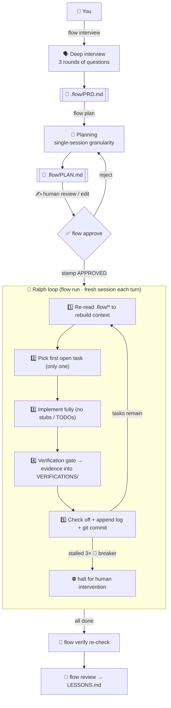

<div align="center">


# ⚡ codex-autoflow

**Interview → Plan → Approve → Execute → Verify → Retrospective**

[](https://git.io/typing-svg)


**[中文文档](README.md)** · **[Design notes](docs/DESIGN.md)** · **[Quick start](#-quick-start)**

</div>

---

## 💀 The four failure modes of bare Codex

| Failure | Symptom | Fix here |
|:---:|:---|:---|
| 🐠 **Goldfish memory** | Fresh session forgets all progress | `.flow/` state contract + per-turn context re-injection |
| 🚶 **No plan** | Codes first, rewrites later | Interview → plan → **human approval** gate |
| 🎭 **Fake done** | "Done!" with zero tests run | Verification gate: evidence or it didn't happen |
| 💥 **Lost on crash** | Cannot safely resume | One commit per task; the disk is the checkpoint |

## ✨ Highlights

| | |
|:---|:---|
| 🔌 **Zero dependencies** | bash + git + codex — no node / python / perl |
| 🗣️ **Deep interview** | Three rounds of questions turn vague ideas into a testable PRD |
| 📝 **Single-session planning** | Tasks sized to fit one focused session, topologically sorted |
| ✅ **Approval gate** | You review one `PLAN.md` — that controls all autonomous execution |
| 🔄 **Ralph loop** | One task per brand-new session; clean context beats long context |
| 🧯 **Stall breaker** | Auto-stops after 3 iterations with no new commit |
| 🔬 **Evidence-based done** | Verification commands + output land in `VERIFICATIONS/` |
| 🧠 **Cross-session memory** | `MEMORY.md` distills lessons and conventions |

## 🚀 Quick start

```bash
git clone https://github.com/KanQiXing/codex-autoflow.git
bash codex-autoflow/install.sh          # installs the flow command + Codex skills

cd your-project
flow init                               # scaffold .flow/ state directory
flow interview "add user authentication"  # 1️⃣ interview → PRD.md
flow plan                               # 2️⃣ planning → PLAN.md
#    ✍️ review & edit PLAN.md by hand
flow approve                            # 3️⃣ stamp of approval
flow run 10                             # 4️⃣ autonomous loop, one fresh session per task
```

> 💡 **You review exactly two documents** (PRD and PLAN); everything else runs itself.
> `tail -f .flow/last-run.log` is your live dashboard.

## 🧠 How it works



## 📋 Command reference

| Command | Purpose | Output |
|:---|:---|:---|
| <kbd>flow init</kbd> | Scaffold state dir + AGENTS contract | `.flow/` |
| <kbd>flow interview</kbd> | Deep-interview the requirement (interactive) | `.flow/PRD.md` |
| <kbd>flow plan</kbd> | PRD → single-session task list | `.flow/PLAN.md` |
| <kbd>flow approve</kbd> | Human approval stamp | `.flow/APPROVED` |
| <kbd>flow run [N]</kbd> | Autonomous loop (default 10, stall breaker ×3) | code + evidence + commits |
| <kbd>flow once</kbd> | Single iteration (prompt debugging) | — |
| <kbd>flow verify</kbd> | Re-verify all completed tasks | refreshes `VERIFICATIONS/` |
| <kbd>flow review</kbd> | Retrospective distillation | `.flow/LESSONS.md` |
| <kbd>flow status</kbd> | Progress overview | — |

## ⚖️ Five iron laws

| # | Law | One-liner |
|:---:|:---|:---|
| 1 | 🗄️ **Everything on disk** | Sessions die, files don't |
| 2 | ✅ **Approve before acting** | Unapproved plans are refused by script *and* prompt |
| 3 | 1️⃣ **One task per session** | Clean context beats long context; one task, one commit |
| 4 | 🔬 **Evidence or it didn't happen** | No verification output, no checkbox |
| 5 | 🔁 **Re-inject context** | Step one of every iteration: re-read `.flow/*` |

<details>
<summary>🧪 <b>Distilled from six projects into one engine</b> (click to expand)</summary>

| Source | Kept | Dropped | Why |
|:---|:---|:---|:---|
| [oh-my-codex](https://github.com/Yeachan-Heo/oh-my-codex) 33k★ | interview→plan→approval gate | multi-agent / HUD | orchestration gains are uncertain; complexity is not |
| [Ralph pattern](https://ghuntley.com/ralph/) | fresh-session loop + single task + git anchors | unbounded loop | unbounded = burning money; replaced with deterministic gate + breaker |
| [planning-with-files](https://github.com/OthmanAdi/planning-with-files) 27k★ | files-as-plan + re-injection | npm distribution | bash + markdown achieves the same, zero deps |
| [codex_autoworker](https://github.com/Frank-Opus/codex_autoworker) | everything-on-disk + evidence-as-done | multi-harness layer | stay focused on Codex |
| [Skills ecosystem](https://github.com/vercel-labs/skills) | SKILL.md progressive disclosure | marketplace | reuse the format, skip the package manager |
| [coding-agent-toolkit](https://github.com/stefan-jansen/coding-agent-toolkit) | staged flow + retrospective | Issue projection | single-repo loop already covers it |

Full rationale in **[docs/DESIGN.md](docs/DESIGN.md)**.

</details>

<details>
<summary>⌨️ <b>Advanced usage</b> (click to expand)</summary>

```bash
# pass extra args to codex (model / sandbox policy)
FLOW_CODEX_ARGS="--model gpt-5.2 --full-auto" flow run 20

# disable the automatic retrospective after completion
FLOW_AUTO_REVIEW=0 flow run

# custom install locations
FLOW_HOME=~/.autoflow-codex FLOW_BIN=~/.local/bin bash install.sh

# live dashboard
tail -f .flow/last-run.log

# skills also trigger naturally inside interactive codex sessions
codex    # then say "help me plan this feature"
```

</details>

## 🙏 Credits

Distilled with respect from:
[Ralph pattern](https://ghuntley.com/ralph/) ·
[oh-my-codex](https://github.com/Yeachan-Heo/oh-my-codex) ·
[planning-with-files](https://github.com/OthmanAdi/planning-with-files) ·
[codex_autoworker](https://github.com/Frank-Opus/codex_autoworker) ·
[Vercel Skills CLI](https://github.com/vercel-labs/skills) ·
[coding-agent-toolkit](https://github.com/stefan-jansen/coding-agent-toolkit) ·
[awesome-codex-cli](https://github.com/ELM-labs-projects/awesome-codex-cli)

---

<div align="center">

**codex-autoflow** — autonomous, but in control.

[📚 Docs](docs/DESIGN.md) · [🐛 Issues](https://github.com/KanQiXing/codex-autoflow/issues) · [⭐ Stars](https://github.com/KanQiXing/codex-autoflow/stargazers)

[MIT](LICENSE) © 2026 codex-autoflow contributors

</div>
