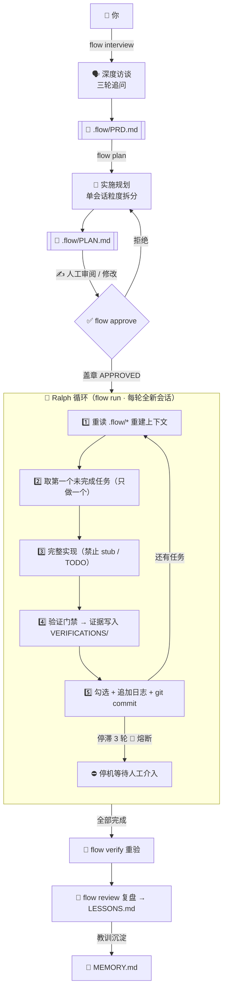

<div align="center">


<br/>

# ⚡ codex-autoflow

### 访谈 → 规划 → 审批 → 持续执行 → 验证 → 复盘

### 蒸馏自 12 个开源项目 · 零依赖 · 一个 bash 文件

<br/>

[](https://git.io/typing-svg)

<br/>


<br/>

**[English](README.en.md)** · **[设计蒸馏](docs/DESIGN.md)** · **[快速上手 ↓](#-60-秒上手)**

</div>

<br/>

<table>
<tr>
<td width="50%">

## 💀 裸用 Codex 的四种死法

| 死法 | 症状 | autoflow 的解药 |
|:---:|:---|:---|
| 🐠 **金鱼记忆** | 新会话忘光上次进展 | `.flow/` 状态契约 + 每轮上下文重注入 |
| 🚶 **无头苍蝇** | 没规划就开干，改一半返工 | 访谈 → 规划 → **人工审批** 三重门禁 |
| 🎭 **假完成** | 「done!」但测试从没跑过 | 验证门禁：证据即完成 |
| 💥 **断线失踪** | 中断后无法安全恢复 | 每任务一提交，磁盘即断点 |

</td>
<td width="50%">

## ✨ 核心特性一览

| | |
|:---|:---|
| 🔌 **零依赖** | bash + git + codex，无 node / python / perl |
| 🗣️ **深度访谈** | 三轮追问把模糊想法澄清成可验收 PRD |
| 📝 **单会话粒度规划** | 任务拆到一轮会话可完成，拓扑排序 |
| ✅ **审批门禁** | 人类只审一份 `PLAN.md`，控制全部执行 |
| 🔄 **Ralph 循环** | 每轮全新会话只做一个任务 |
| 🧯 **停滞熔断** | 连续 3 轮无提交自动停机 |
| 🔬 **证据即完成** | 验证输出落盘 `VERIFICATIONS/` |
| 🧠 **跨会话记忆** | `MEMORY.md` 蒸馏教训与约定 |
| 🚄 **flow powerup** | 一条命令体检调优 Codex 本体 |
| 🌐 **flow hub** | 技能发现/安装/策展/安全审计 |

</td>
</tr>
</table>

<br/>

<div align="center">

## 🚀 60 秒上手

</div>

```bash
git clone https://github.com/KanQiXing/codex-autoflow.git
bash codex-autoflow/install.sh          # 安装 flow 命令 + Codex 技能

cd your-project
flow init                               # 初始化 .flow/ 状态目录
flow interview "我想给系统加用户认证"     # 1️⃣ 访谈 → PRD.md
flow plan                               # 2️⃣ 规划 → PLAN.md
#    ✍️ 人工审阅并修改 PLAN.md，改到满意
flow approve                            # 3️⃣ 盖章放行
flow run 10                             # 4️⃣ 自治循环，每轮一个全新会话
```

> 💡 **你只需审两份文档**（PRD 与 PLAN），其余全部自主执行。
> `tail -f .flow/last-run.log` 就是实时仪表盘。

<details>
<summary>🖥️ <b>看看运行起来什么样</b>（点击展开）</summary>

```text
$ flow status
──────────────────────────────────────────────
[flow] 审批: 已批准 · 任务: 7/9 完成 · 剩余 2
[flow] 最近一轮输出（末 3 行）:
       [flow(T008)] 验证: npm test → 12 passed
       [flow(T008)] 提交: a1b2c3d
       剩余任务 1
[flow] 最近 flow 提交:
       a1b2c3d flow(T008): 实现审批印章逻辑
       e4f5g6h flow(T007): 添加停滞熔断
       ...
──────────────────────────────────────────────
```

```text
$ flow run 10
[flow] 迭代 1/10 · 剩余任务 9
[flow] 迭代 2/10 · 剩余任务 8
    [flow(T001)] 实现: 用户表迁移 + 模型
    [flow(T001)] 验证: npm test → 全部通过
    [flow(T001)] 提交: 8f3e21a
[flow] 迭代 3/10 · 剩余任务 7
    ...
[ ok ] 全部任务完成（共 9 轮迭代）
[flow] 触发复盘: flow review
```

</details>

<br/>

<div align="center">

## 🔧 三大引擎模块

</div>

<table>
<tr>
<th width="33%" align="center">

## 🔄 项目自治引擎

</th>
<th width="33%" align="center">

## 🚄 Codex 本体增压

</th>
<th width="33%" align="center">

## 🌐 技能生态中心

</th>
</tr>
<tr>
<td valign="top">

**6 阶段闭环：**

```
interview  → PRD.md
plan       → PLAN.md
approve    → APPROVED
run [N]    → 代码+证据
verify     → VERIFICATIONS/
review     → LESSONS.md
```

**铁律：**
- 一切落盘
- 先审后动
- 单任务循环
- 证据即完成
- 上下文重注入
- 停滞 3 轮熔断

</td>
<td valign="top">

**5 大增强面：**

| 面 | 覆盖 |
|:---|:---|
| 📄 AGENTS.md | 四层指令链 + 治理原则 |
| 🤖 子代理 | 三件套 TOML 角色 |
| ⚙️ config | 模型路由 + 护栏 |
| 🎯 技能面 | description 优化 |
| 🔌 MCP | 服务器 + 界面端 |

```bash
flow powerup
flow powerup install
```

</td>
<td valign="top">

**策展 10+ 社区来源：**

| 来源 | 规模 |
|:---|:---|
| antigravity-skills | 46.3k★ · 2100+ 技能 |
| awesome-ai-skills | 179★ · 103 技能 |
| awesome-codex-skills | 16.4k★ |
| design-skills | 2.8k★ |
| gamedev-skills | 963★ |
| SAIL 安全 | 91 项 |

```bash
flow hub
```

含：技能自进化 · 安全审计 · 全局 Ledger

</td>
</tr>
</table>

<br/>

<div align="center">

## 🧠 工作原理

</div>



<br/>

<div align="center">

## 📋 命令速查

</div>

<table>
<tr>
<td width="50%">

### 项目工作流

| 命令 | 作用 |
|:---|:---|
| <kbd>flow init</kbd> | 初始化状态目录 + AGENTS 契约 |
| <kbd>flow interview</kbd> | 深度访谈澄清需求 |
| <kbd>flow plan</kbd> | PRD → 任务清单 |
| <kbd>flow approve</kbd> | 人工批准计划 |
| <kbd>flow run [N]</kbd> | 自治循环（默认 10 轮） |
| <kbd>flow once</kbd> | 单轮执行（调试用） |
| <kbd>flow verify</kbd> | 重验全部已完成任务 |
| <kbd>flow review</kbd> | 复盘蒸馏 → LESSONS.md |
| <kbd>flow rollback TXXX</kbd> | 回滚指定任务 |
| <kbd>flow status</kbd> | 进度概览 |

</td>
<td width="50%">

### Codex 增强

| 命令 | 作用 |
|:---|:---|
| <kbd>flow powerup</kbd> | 体检+调优 Codex 本体 |
| <kbd>flow powerup install</kbd> | 装三件套子代理 |
| <kbd>flow hub</kbd> | 技能发现/策展/安全审计 |

### 7 个内置技能

| 技能 | 触发场景 |
|:---|:---|
| `flow-interview` | 需求澄清 |
| `flow-plan` | 任务拆分 |
| `flow-execute` | 单任务实现 |
| `flow-verify` | 验证收集 |
| `flow-review` | 复盘蒸馏 |
| `flow-powerup` | Codex 调优 |
| `flow-skills-hub` | 技能生态 |

</td>
</tr>
</table>

<br/>

<div align="center">

## 📁 `.flow/` 状态契约

</div>

| 文件 | 角色 | 谁写 |
|:---|:---|:---:|
| `PRD.md` | 需求唯一事实来源 | 🗣️ interview |
| `PLAN.md` | 任务清单 `- [ ]` / `- [x]` | 📝 plan 生成，🔄 execute 勾选 |
| `PROGRESS.md` | 追加式执行日志（只追加不删改） | 🔄 execute |
| `MEMORY.md` | 跨会话记忆（教训 / 约定） | 🔄 execute · 📖 review |
| `VERIFICATIONS/` | 验证证据（每任务一份） | 🔄 execute · 🔬 verify |
| `APPROVED` | 审批印章 | 👤 **你** |
| `last-run.log` | 最近一轮 codex 输出 | ⚙️ run |

<br/>

<div align="center">

## ⚖️ 五条铁律

</div>

<table>
<tr>
<th width="40%" align="center">铁律</th>
<th width="60%" align="center">一句话</th>
</tr>
<tr>
<td align="center">🗄️ <b>一切落盘</b></td>
<td>会话随时会被杀，磁盘不会；恢复靠文件不靠记忆</td>
</tr>
<tr>
<td align="center">✅ <b>先审后动</b></td>
<td>未审批的计划，脚本与提示词双重拒绝执行</td>
</tr>
<tr>
<td align="center">1️⃣ <b>单任务循环</b></td>
<td>每轮全新会话只做一个任务，一个任务一个提交</td>
</tr>
<tr>
<td align="center">🔬 <b>证据即完成</b></td>
<td>没有验证证据不许勾选任务</td>
</tr>
<tr>
<td align="center">🔁 <b>上下文重注入</b></td>
<td>每轮第一步永远是重读 `.flow/*`</td>
</tr>
</table>

<br/>

<details>
<summary>🧪 <b>设计蒸馏：12 个项目 → 一个引擎</b>（点击展开完整取舍表）</summary>

### 第一波：工作流引擎骨架

| 来源 | 星数 | 取 | 舍 | 舍弃理由 |
|:---|:---|:---|:---|:---|
| [oh-my-codex](https://github.com/Yeachan-Heo/oh-my-codex) | 33k★ | 访谈→规划→审批门禁 | 多智能体 / HUD | 编排收益不稳定，复杂度上升是确定的 |
| [Ralph 模式](https://ghuntley.com/ralph/) | — | 新会话循环 + 单任务 + git 锚点 | 无界循环 | 无界 = 失控烧钱；改确定性门禁 + 熔断 |
| [planning-with-files](https://github.com/OthmanAdi/planning-with-files) | 27k★ | 文件即计划 + 重注入 | npm 分发 | bash + markdown 达成同样效果 |
| [codex_autoworker](https://github.com/Frank-Opus/codex_autoworker) | — | 一切落盘 + 证据即完成 | 多 harness 层 | 聚焦 Codex，砍掉间接层 |
| [Skills 生态](https://github.com/vercel-labs/skills) | 20k★ | SKILL.md 渐进披露 | 市场化分发 | 复用格式，不需要包管理器 |
| [coding-agent-toolkit](https://github.com/stefan-jansen/coding-agent-toolkit) | — | 阶段化流程 + 复盘 | Issue 投影 | 单仓库闭环已覆盖 |

### 第二波：Codex 本体增强

| 来源 | 星数 | 取 | 舍 | 舍弃理由 |
|:---|:---|:---|:---|:---|
| [awesome-codex-subagents](https://github.com/VoltAgent/awesome-codex-subagents) | 6.2k★ · 130+ 代理 | 沙箱哲学 / 模型路由 / TOML 规范 | 全量代理 | 精馏为 3 个普适角色 |
| [Codex 官方文档 2026](https://developers.openai.com/codex/subagents) | — | Skills 四作用域 / 2% 预算 | — | 直接采用 |
| CLAUDE.md 治理经验（社区广泛流传） | — | 四行为铁则 | 逐条规则 | 原则可迁移，规则不可 |
| [cc-switch](https://github.com/farion1231/cc-switch) | 132k★ | 多 harness 配置管理 | 桌面 App | bash 覆盖核心路径 |
| [ui-ux-pro-max](https://github.com/nextlevelbuilder/ui-ux-pro-max-skill) | 127k★ | 技能面推荐项 | 内置 | 非普适场景 |

### 第三波：技能生态

| 来源 | 星数 | 取 | 舍 | 舍弃理由 |
|:---|:---|:---|:---|:---|
| [awesome-ai-agent-skills](https://github.com/seb1n/awesome-ai-agent-skills) | 179★ | 10 分类法 / 103 技能策展 | 全量内置 | 按需导航而非全量打包 |
| [SkillHone](https://github.com/Tencent/SkillHone) | 149★ | 决策记录 → 自进化循环 | Git issue/PR/wiki 自动化 | 保留核心循环，bash 实现更轻 |
| [codex-skills CLI（社区模式）](https://github.com/search?q=codex+skills+cli&type=repositories) | — | 全局 Ledger / verify 命令 | npm CLI | 纳入 flow hub 技能正文 |
| [sail-skill](https://github.com/pillar-labs/sail-skill) | 119★ | 91 项安全风险目录 | 独立安装 | 纳入 references 供按需触发 |
| [design-harness](https://github.com/tigerless-labs/design-harness) | 217★ | 论文 → 可辩护设计 + provenance | Python 可视化 | 保留思维模式，去掉工具依赖 |
| [antigravity-awesome-skills](https://github.com/sickn33/agentic-awesome-skills) | 46.3k★ · 2100+ 技能 | npx 安装标准 / bundle 策略 | 全量打包 | 策展导航而非打包 |

完整取舍论证见 **[docs/DESIGN.md](docs/DESIGN.md)**。

</details>

<details>
<summary>⌨️ <b>高级用法</b>（点击展开）</summary>

```bash
# 给 codex 传额外参数（模型 / 沙箱策略）
FLOW_CODEX_ARGS="--model gpt-5.2" flow run 20

# 单任务超时（默认 600 秒）
FLOW_TASK_TIMEOUT=900 flow run

# 跳过文件锁（用于故障恢复）
FLOW_FORCE=1 flow run

# 关闭完成后的自动复盘
FLOW_AUTO_REVIEW=0 flow run

# 自定义安装位置
FLOW_HOME=~/.autoflow-codex FLOW_BIN=~/.local/bin bash install.sh

# 实时仪表盘
tail -f .flow/last-run.log

# 技能也可在交互式 codex 会话中被自然触发（渐进披露）
codex    # 然后说"帮我规划这个功能"
```

> ⚠️ **安全警告**：不建议配合 `--full-auto` 使用 `flow run`。
> 初始审批后每个任务将全自动执行，任务间无人工审查环节。
> 仅在受信任的沙箱环境中使用，并确保工作目录无敏感文件。

</details>

<br/>

<div align="center">

---

## 🙏 致谢

站在巨人肩膀上的蒸馏，向以下项目致敬：

<br/>

<sub>

**工作流引擎** — [Ralph 模式](https://ghuntley.com/ralph/) · [oh-my-codex](https://github.com/Yeachan-Heo/oh-my-codex) · [planning-with-files](https://github.com/OthmanAdi/planning-with-files) · [codex_autoworker](https://github.com/Frank-Opus/codex_autoworker) · [coding-agent-toolkit](https://github.com/stefan-jansen/coding-agent-toolkit)

**Codex 增强** — [Vercel Skills CLI](https://github.com/vercel-labs/skills) · [awesome-codex-subagents](https://github.com/VoltAgent/awesome-codex-subagents) · [cc-switch](https://github.com/farion1231/cc-switch) · [ui-ux-pro-max](https://github.com/nextlevelbuilder/ui-ux-pro-max-skill)

**技能生态** — [awesome-ai-agent-skills](https://github.com/seb1n/awesome-ai-agent-skills) · [SkillHone](https://github.com/Tencent/SkillHone) · [awesome-codex-skills](https://github.com/composio-community/awesome-codex-skills) · [awesome-design-skills](https://github.com/bergside/awesome-design-skills) · [awesome-gamedev-agent-skills](https://github.com/gamedev-skills/awesome-gamedev-agent-skills) · [sail-skill](https://github.com/pillar-labs/sail-skill) · [design-harness](https://github.com/tigerless-labs/design-harness) · [antigravity-awesome-skills](https://github.com/sickn33/agentic-awesome-skills) · [ok-skills](https://github.com/mxyhi/ok-skills)

</sub>

</div>

<br/>

<div align="center">

**codex-autoflow** — 自主，但可控。

<br/>

[📚 文档](docs/DESIGN.md) · [🐛 报告问题](https://github.com/KanQiXing/codex-autoflow/issues) · [⭐ 点个星标](https://github.com/KanQiXing/codex-autoflow/stargazers)

[MIT](LICENSE) © 2026 codex-autoflow contributors

</div>
