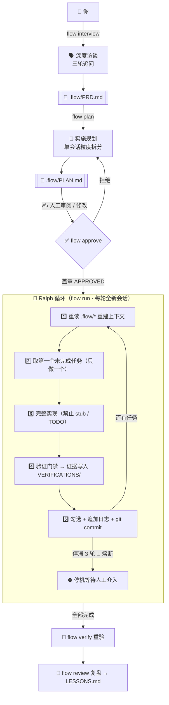

<div align="center">


# ⚡ codex-autoflow

**访谈 → 规划 → 审批 → 持续执行 → 验证 → 复盘**

[](https://git.io/typing-svg)


**[English](README.en.md)** · **[设计蒸馏](docs/DESIGN.md)** · **[60 秒上手](#-60-秒上手)**

</div>

---

## 💀 裸用 Codex 的四种死法

| 死法 | 症状 | autoflow 的解药 |
|:---:|:---|:---|
| 🐠 **金鱼记忆** | 新会话忘光上次进展 | `.flow/` 状态契约 + 每轮上下文重注入 |
| 🚶 **无头苍蝇** | 没规划就开干，改一半返工 | 访谈 → 规划 → **人工审批** 三重门禁 |
| 🎭 **假完成** | 「done!」但测试从没跑过 | 验证门禁：证据即完成 |
| 💥 **断线失踪** | 中断后无法安全恢复 | 每任务一提交，磁盘即断点 |

## ✨ 核心特性

| | |
|:---|:---|
| 🔌 **零依赖** | bash + git + codex，无 node / python / perl |
| 🗣️ **深度访谈** | 三轮追问把模糊想法澄清成可验收 PRD |
| 📝 **单会话粒度规划** | 任务拆到一轮会话可完成，拓扑排序 |
| ✅ **审批门禁** | 人类只审一份 `PLAN.md`，即控制全部自主执行 |
| 🔄 **Ralph 循环** | 每轮全新会话只做一个任务，干净上下文胜过长上下文 |
| 🧯 **停滞熔断** | 连续 3 轮无新提交自动停机，防止烧钱空转 |
| 🔬 **证据即完成** | 验证命令 + 输出落盘 `VERIFICATIONS/`，无证据不勾选 |
| 🧠 **跨会话记忆** | `MEMORY.md` 蒸馏教训与约定，对抗上下文腐烂 |

## 🚀 60 秒上手

```bash
git clone https://github.com/KanQiXing/codex-autoflow.git
bash codex-autoflow/install.sh          # 安装 flow 命令 + Codex 技能

cd your-project
flow init                               # 初始化 .flow/ 状态目录
flow interview "我想给系统加用户认证"     # 1️⃣ 访谈 → PRD.md
flow plan                               # 2️⃣ 规划 → PLAN.md
#    ✍️ 人工审阅并修改 PLAN.md，改到满意
flow approve                            # 3️⃣ 盖章放行
flow run 10                             # 4️⃣ 自治循环，每轮一个全新会话
```

> 💡 **你只需审两份文档**（PRD 与 PLAN），其余全部自主执行。
> `tail -f .flow/last-run.log` 就是实时仪表盘。

<details>
<summary>🖥️ <b>看看运行起来什么样</b>（点击展开）</summary>

```text
$ flow status
──────────────────────────────────────────────
[flow] 审批: 已批准 · 任务: 7/9 完成 · 剩余 2
[flow] 最近一轮输出（末 3 行）:
       [flow(T008)] 验证: npm test → 12 passed
       [flow(T008)] 提交: a1b2c3d
       剩余任务 1
[flow] 最近 flow 提交:
       a1b2c3d flow(T008): 实现审批印章逻辑
       e4f5g6h flow(T007): 添加停滞熔断
       ...
──────────────────────────────────────────────
```

```text
$ flow run 10
[flow] 迭代 1/10 · 剩余任务 9
[flow] 迭代 2/10 · 剩余任务 8
    [flow(T001)] 实现: 用户表迁移 + 模型
    [flow(T001)] 验证: npm test → 全部通过
    [flow(T001)] 提交: 8f3e21a
[flow] 迭代 3/10 · 剩余任务 7
    ...
[ ok ] 全部任务完成（共 9 轮迭代）
[flow] 触发复盘: flow review
```

</details>

## 🧠 工作原理



## 📋 命令速查

| 命令 | 作用 | 产物 |
|:---|:---|:---|
| <kbd>flow init</kbd> | 初始化状态目录 + AGENTS 契约 | `.flow/` |
| <kbd>flow interview</kbd> | 深度访谈澄清需求（交互式） | `.flow/PRD.md` |
| <kbd>flow plan</kbd> | PRD → 单会话粒度任务清单 | `.flow/PLAN.md` |
| <kbd>flow approve</kbd> | 人工批准计划 | `.flow/APPROVED` |
| <kbd>flow run [N]</kbd> | 自治循环（默认 10 轮，停滞 3 轮熔断） | 代码 + 证据 + 提交 |
| <kbd>flow once</kbd> | 单轮执行（调试提示词用） | — |
| <kbd>flow verify</kbd> | 重验全部已完成任务 | 刷新 `VERIFICATIONS/` |
| <kbd>flow review</kbd> | 复盘蒸馏 | `.flow/LESSONS.md` |
| <kbd>flow status</kbd> | 进度概览 | — |

## 📁 `.flow/` 状态契约

| 文件 | 角色 | 谁写 |
|:---|:---|:---:|
| `PRD.md` | 需求唯一事实来源 | 🗣️ interview |
| `PLAN.md` | 任务清单 `- [ ]` / `- [x]` | 📝 plan 生成，🔄 execute 勾选 |
| `PROGRESS.md` | 追加式执行日志（只追加不删改） | 🔄 execute |
| `MEMORY.md` | 跨会话记忆（教训 / 约定） | 🔄 execute · 📖 review |
| `VERIFICATIONS/` | 验证证据（每任务一份） | 🔄 execute · 🔬 verify |
| `APPROVED` | 审批印章 | 👤 **你** |
| `last-run.log` | 最近一轮 codex 输出 | ⚙️ run |

## ⚖️ 五条铁律

| # | 铁律 | 一句话 |
|:---:|:---|:---|
| 1 | 🗄️ **一切落盘** | 会话随时会被杀，磁盘不会；恢复靠文件不靠记忆 |
| 2 | ✅ **先审后动** | 未审批的计划，脚本与提示词双重拒绝执行 |
| 3 | 1️⃣ **单任务循环** | 每轮全新会话只做一个任务，一个任务一个提交 |
| 4 | 🔬 **证据即完成** | 没有验证证据不许勾选任务 |
| 5 | 🔁 **上下文重注入** | 每轮第一步永远是重读 `.flow/*` |

<details>
<summary>🧪 <b>设计蒸馏：六大项目 → 一个引擎</b>（点击展开取舍全表）</summary>

| 来源 | 取 | 舍 | 舍弃理由 |
|:---|:---|:---|:---|
| [oh-my-codex](https://github.com/Yeachan-Heo/oh-my-codex) 33k★ | 访谈→规划→审批门禁 | 多智能体 / HUD | 编排收益不稳定，复杂度上升是确定的 |
| [Ralph 模式](https://ghuntley.com/ralph/) | 新会话循环 + 单任务 + git 锚点 | 无界循环 | 无界 = 失控烧钱；改确定性门禁 + 熔断 |
| [planning-with-files](https://github.com/OthmanAdi/planning-with-files) 27k★ | 文件即计划 + 重注入 | npm 分发 | bash + markdown 达成同样效果 |
| [codex_autoworker](https://github.com/Frank-Opus/codex_autoworker) | 一切落盘 + 证据即完成 | 多 harness 层 | 聚焦 Codex，砍掉间接层 |
| [Skills 生态](https://github.com/vercel-labs/skills) | SKILL.md 渐进披露 | 市场化分发 | 复用格式，不需要包管理器 |
| [coding-agent-toolkit](https://github.com/stefan-jansen/coding-agent-toolkit) | 阶段化流程 + 复盘 | Issue 投影 | 单仓库闭环已覆盖 |

完整取舍论证见 **[docs/DESIGN.md](docs/DESIGN.md)**。

</details>

<details>
<summary>⌨️ <b>高级用法</b>（点击展开）</summary>

```bash
# 给 codex 传额外参数（模型 / 沙箱策略）
FLOW_CODEX_ARGS="--model gpt-5.2 --full-auto" flow run 20

# 关闭完成后的自动复盘
FLOW_AUTO_REVIEW=0 flow run

# 自定义安装位置
FLOW_HOME=~/.autoflow-codex FLOW_BIN=~/.local/bin bash install.sh

# 实时仪表盘
tail -f .flow/last-run.log

# 技能也可在交互式 codex 会话中被自然触发（渐进披露）
codex    # 然后说"帮我规划这个功能"
```

</details>

## 🙏 致谢

站在巨人肩膀上的蒸馏，向以下项目致敬：

[Ralph 模式](https://ghuntley.com/ralph/) ·
[oh-my-codex](https://github.com/Yeachan-Heo/oh-my-codex) ·
[planning-with-files](https://github.com/OthmanAdi/planning-with-files) ·
[codex_autoworker](https://github.com/Frank-Opus/codex_autoworker) ·
[Vercel Skills CLI](https://github.com/vercel-labs/skills) ·
[coding-agent-toolkit](https://github.com/stefan-jansen/coding-agent-toolkit) ·
[awesome-codex-cli](https://github.com/ELM-labs-projects/awesome-codex-cli)

---

<div align="center">

**codex-autoflow** — 自主，但可控。

[📚 文档](docs/DESIGN.md) · [🐛 报告问题](https://github.com/KanQiXing/codex-autoflow/issues) · [⭐ 点个星标](https://github.com/KanQiXing/codex-autoflow/stargazers)

[MIT](LICENSE) © 2026 codex-autoflow contributors

</div>
